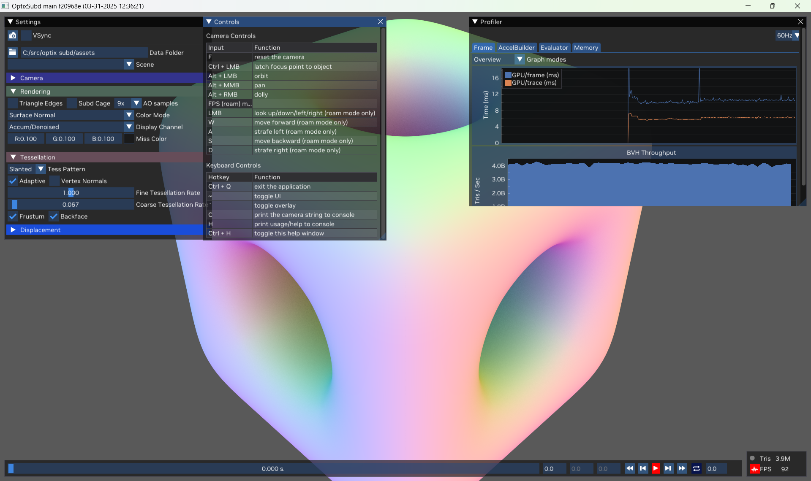
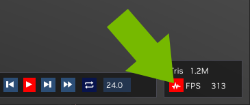

# OptiX Dynamic Subd Tessellation Sample

## Overview

This is an OptiX/CUDA code sample showing how to quickly build ray-tracing acceleration structures
for dynamic subdivision surfaces using the Cluster API introduced in OptiX 9.0.
The scene is re-tessellated and a new acceleration structure is built on every frame.  You can load 
your own scenes from OBJ files or JSON scene files.

It shares some common origins with the [RTXMG DX12 code sample](https://github.com/NVIDIA-RTX/RTXMG).

## Features

* Adaptive tessellation of Catmull-Clark limit surfaces using CUDA
* Animated scenes 
* Optional displacement maps
* Fast BVH build with OptiX 9.0
* Real-time raytracing with OptiX.  OpenGL is only used for image display, UI, and wireframe lines.

## How to Download Scene Assets

**IMPORTANT** We do not include scene assets in this repo, due to their size.  You will need to do one of two things
to get them:
  * Manually clone the [RTXMG-Sample-Assets](https://github.com/NVIDIA-RTX/RTXMG-Sample-Assets) into a directory or
    symlink named "assets" inside the top of the project (the name is special and must be exactly as described).
  * Or, set the CMake variable `ENABLE_ASSET_DOWNLOAD=1` and reconfigure to automatically clone into "assets"

You can also download or create your own OBJ files, or use a simple json format for multi-object scenes with transforms.  Please refer to the [RTXMG documentation](https://github.com/NVIDIA-RTX/RTXMG/blob/main/docs/QuickStart.md#obj-extensions) for scene file syntax.

Animation is supported via a series of OBJ files with vertex positions.  See the Barbarian sample scene.

## Requirements

- [CUDA Toolkit](https://developer.nvidia.com/cuda-toolkit), version 12+
- NVIDIA RTX GPU (Ampere or later with 8+ GB VRAM recommended)
- CMake version 3.27.7+
- Visual Studio 2022 or GCC 12+ (older versions may work but are untested)


## Build

1. Clone the repository **with all submodules recursively**, since we use a submodule for the [OSD-Lite repo](https://github.com/NVIDIA-RTX/OSD-Lite).
   
   `git clone --recurse-submodules https://github.com/NVIDIA/optix-subd.git`

2. Use CMake to configure the build and generate the project files or Makefiles.
   The first time will take a little longer, as OptiX headers, Glfw, Glad, etc., are automatically fetched.  

   You can run CMake using the gui or via command line:
   
   ```
   cmake CMakeLists.txt -B ./build -DCMAKE_BUILD_TYPE=Release
   ```  

3. Build the solution generated by CMake in the `./build/` folder.

   For example, if using Visual Studio or vscode, open the generated solution `build/OptixSubd.sln`, select the
   **Release** build type, and build all.

   You should prefer Release builds, since OptiX shaders built in Debug are significantly slower to execute.

4. (Optional) Clone the scene assets repo as described above and link or copy it to the `optix-subd/assets` directory.
    For example, to clone directly:
    ```
    git clone https://github.com/NVIDIA-RTX/RTXMG-Sample-Assets.git assets
    ```

5. Select and run the `optixSubd` project. Binaries get built to the `build/bin` folder. 


## User Interface

The first time you run it, the app will show a simple default subdivision surface and will populate the scene
selection menu with files found in the `assets` directory.



The camera is in Orbit mode by default (similar to Maya); use mouse buttons to orbit about 
a pivot point.  Control-click on the scene to change the pivot.  You can also switch to 
Roam mode in the UI and use W/S/A/D keys.

Hover the mouse over widgets to read tool-tips.

The window layout and camera mode are saved between runs to an imgui config file in the build dir. 
The Profiler window can always be toggled from the button next to the FPS counter.



## Command Line

- `-i` loads a specific .scene.json or OBJ file
- `-h` prints a help message with other flags

## Contact

Please report any issues directly through the GitHub issue tracker, or post general questions to the 
[OptiX forum](https://forums.developer.nvidia.com/c/gaming-and-visualization-technologies/visualization/optix/167).


## Related Resources


OptiX:
  * [OptiX SDK](https://developer.nvidia.com/designworks/optix/download)
  *  [OptiX 9.0 Programming Guide](https://raytracing-docs.nvidia.com/optix9/guide/index.html#preface#)
  *  [OptiX forum](https://forums.developer.nvidia.com/c/gaming-and-visualization-technologies/visualization/optix/167)

DX:
  * [RTX Megageometry](https://github.com/NVIDIA-RTX/RTXMG/) 

Vulkan
  * [vk_animated_clusters](https://github.com/nvpro-samples/vk_animated_clusters) :
    `VK_NV_cluster_acceleration_structure` for animated content.
  * [vk_tessellated_clusters](https://github.com/nvpro-samples/vk_tessellated_clusters) :
    adaptive triangle tessellation and displacement using `VK_NV_cluster_acceleration_structure`
  * [vk_lod_clusters](https://github.com/nvpro-samples/vk_lod_clusters) :
    cluster-lod system and streaming using `VK_NV_cluster_acceleration_structure`
  * [vk_partitioned_tlas](https://github.com/nvpro-samples/vk_partitioned_tlas)
    update the TLAS of large dynamic scenes with `VK_NV_partitioned_acceleration_structure`

Tools
  * [nv_cluster_builder](https://github.com/nvpro-samples/nv_cluster_builder) 
    spatial clustering algorithms for triangle meshes (C++ library)
  * [nv_cluster_lod_builder](https://github.com/nvpro-samples/nv_cluster_lod_builder)
    continuous level of detail (LOD) for triangle meshes (C++ library)

## Known Issues

1. First a caveat: this started as a research project at NVIDIA, not as production code.

2. We have an old, modified version of [optix-toolkit](https://github.com/NVIDIA/optix-toolkit),
   inlined into our source tree.

3. Our memory management is basic: we grow geometry buffers on demand and never shrink them.  
   It is possible to create enough clusters and triangles to exceed GPU memory, and then the app will just crash.
   You may hit this for example by increasing the adaptive tess slider in the UI and then moving
   the camera very close to a surface.

4. Since we don't constrain exactly how many triangles will be generated on any given frame, we read
   back intermediate values from the tessellation kernels and use them to resize our geometry buffers, and also to report
   stats in the API.  This readback could be avoided if we were willing to allocate a large, fixed-size 
   buffer on scene load.

5. We re-tessellate the scene every frame, even if nothing changed.  This makes it easier to look at performance,
   but a real app may wish to track scene changes more carefully.


